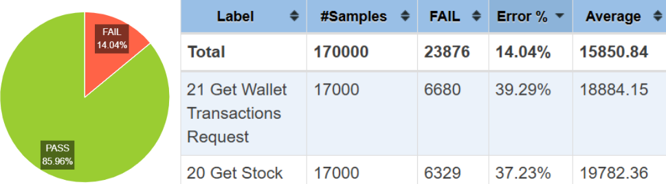
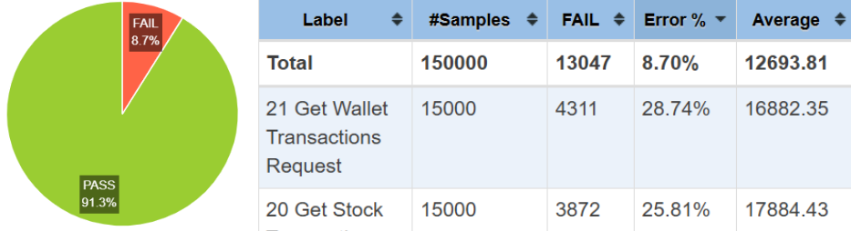
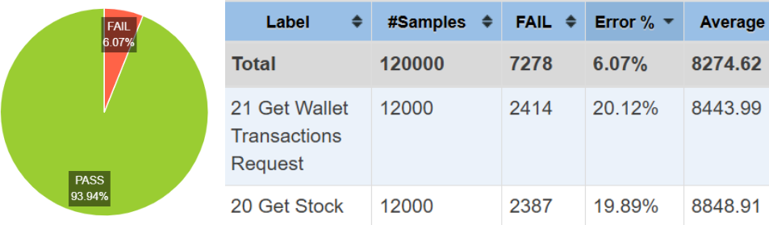

# Stock Trading App – Scalable Distributed System

A containerized stock trading platform built to endure high-throughput, real-world simulation; sustaining over 17,000 concurrent users under load. The system executes market and limit orders via a custom FIFO matching engine, ensures atomic transaction integrity, and scales through Docker-managed microservices.

Performance bottlenecks were addressed through targeted JMeter stress testing, Redis-based concurrency control, and HAProxy-NGINX experimentation. Complexities like VM crashes, mutex race conditions, and HTTP timeouts were resolved through iterative refactoring and architecture rollback strategies.

| Simulated Users | Error Rate   |
|------------------|--------------|
| 1,000            | 0.00%        |
| 10,000           | 3.94%        |
| 12,000           | 6.07%        |
| 15,000           | 8.70%        |
| **17,000**       | **14.04%**   |

[](https://www.docker.com/)
[](https://jmeter.apache.org/)
[](#)
[](https://jwt.io/)
[](https://redis.io/)
[](#)
[](#)
[](#)


## Results


[Result for 17k Users: 14.04% Error](./results/17k_users_best.pdf)


[Result for 15k Users: 8.70% Error](./results/15k_users.pdf)


[Result for 15k Users: 6.07% Error](./results/12k_users.pdf)

## Performance Testing Workflow

> Port: `4000`  

### 1. Clone the Repo

```bash
git clone https://github.com/danigallegdup/Stock_Trading_App
cd Stock_Trading_App
```

---

### 2. Build and Start the Services

```bash
docker compose up -d --build
```

---

### 3. System Initialization

```bash
cd TestRun3
nano Config/stockIds.csv
# Ensure it's empty
# CTRL+O to save, CTRL+X to exit
```

Then initialize baseline stocks:

```bash
jmeter -n -t ./InitialSetup.jmx
```

> 🔍 Verify `Config/stockIds.csv` has no extra lines before proceeding.

---

### 4. Simulate 17k+ Concurrent Users

```bash
HEAP="-Xms1g -Xmx4g -XX:MaxMetaspaceSize=256m" \
jmeter -n -t test17k.jmx -l 17k_results.log -e -o 17k_results
```

View detailed test results:
```
17k_results/index.html
```

---

### 5. Clean Shutdown

```bash
docker compose down -v
```
